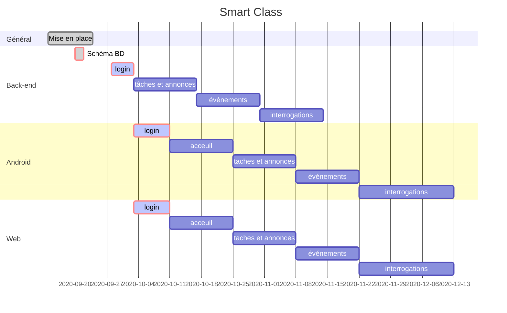

# Projet Smart Class

## Sprint 1 

### Résumé du sprint 

* Design de l'écran de connexion 

  * Choix palette de couleurs 

    

### à Améliorer

* /

### Prochain sprint 

* Trouver sujet application 
* Mise en place Trello 
* Mise en place Github
* Mocks des pages de login
* 

## Sprint 2

### Résumé du sprint 

* Sujet de l'application trouvé
* Mise en place du Trello
* Mise en place du Github

### à Améliorer

* 

### Prochain sprint 

* 

## Sprint X

### Résumé du sprint 

* 

### à Améliorer

* 

### Prochain sprint 

* 

